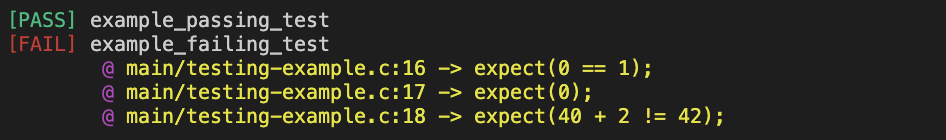

## Custom C Testing Library
This is a custom built testing library that gracefully checks for assertions without crashing the program. All failed assertions are logged. The images below show the terminal output for passing and failing tests (source code in `main/testing-example.c`).

```
anshulkamath::testing » ./bin/testing-example
[PASS] example_passing_test
[FAIL] example_failing_test
        @ main/testing-example.c:16 -> expect(0 == 1);
        @ main/testing-example.c:17 -> expect(0);
        @ main/testing-example.c:18 -> expect(40 + 2 != 42);
```

In the console:



## Installation
To use this library, you must download the repo and make the library archive files. This can be done using
```
make libs
```
This will create a `libs/` folder with two `.a` files. You can move these `.a` files to your project library. Additionally, you must copy the include headers `testing-logger.h` and `linked-list.h` to your project include directory as well. Finally, you must link to `-ltesting-logger` and `-llinked-list` when compiling.
